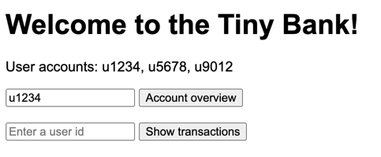

# Tiny Bank

This is a simple bank application that is used to demonstrate resilience and performance testing.

## Explore Tiny Bank

To run the Tiny Bank application, execute the `start-test-components.sh` script in the root directory 
of this project. The `start-test-components.sh` script has two options: `--otel-agent` and `--jfr-agent`.
These will enable the agents in the Tiny Bank Service JVM application.

To run a load test, simply start via the `start-test.sh` script. After running the test all components are stopped.

When you start the test, you will see the options you can choose from. There are two types of resiliencs tests:
one with wiremock to delay the remote stubs (to fetch account info and the balance), and the other with Toxiproxy to 
delay the database.

To run with both the OTEL agent and the JFR agent, use the following command:

```shell
export ENABLE_JFR_AGENT=true
export ENABLE_OTEL_AGENT=true
./start-test.sh
```

To run a resilience test with ToxiProxy to slow down the database, use the following command:

```shell
export IS_SLOW_DB_TEST=true
./start-test.sh
```

If you want to change the setting to default do unset on the env variable, like so: `unset IS_SLOW_DB_TEST`.

```shell

The Tiny Bank application is now running and can be accessed at `http://localhost:13000`.



## Overview

1. **Tiny Bank Application**  
   The core of the system is a Spring Boot service with a simple node HTML application on top with the following screens:
    - **Account overview**: Calls two external services to 1) fetch account details and 2) the current account balance for users.
    - **Transactions overview**: Get latest payment transactions for the user. The transactions are in a PostgreSQL database.

2. **WireMock Services**  
   Two WireMock servers are used to simulate the remote services:
    - One provides **account information**, such as user details and available accounts.
    - The other provides the **current account balance** for given accounts.
    
   These Wiremock services can simulate delays or errors for resilience testing.

3. **PostgreSQL database**  
   The database contains transactions information. The Tiny Bank application uses this database
   to get the most recent transaction for the transaction overview screen.

4. **k6 load script**
    - **k6** is used to generate simulated user load on the Tiny Bank application.
    - This helps test the resilience and scalability of the system under heavy traffic conditions.
    - Care is taken that it is an "open system" so that the arrival rate of requests stays constant when the responses slow down.

5. **Event Scheduler**
    - The event scheduler is used to introduce delays intentionally for the WireMock services.
    - By slowing down responses from the external services, the system's behavior under such conditions can be
      evaluated, testing fault tolerance and timeout mechanisms.

Together, these components form a robust and testable system designed to demonstrate resilient patterns while handling
real-world scenarios like high load, service delays, and database dependencies.

## Observability

To observe the behavior of the system under load, metrics are collected using the following tools:

1. **Actuator Endpoints**  
   The Tiny Bank Spring Boot application exposes actuator endpoints with information about the application's health,
   metrics, and other details. These endpoints are used to monitor the application's status and performance.
2. **Prometheus** 
   Prometheus is used to store the Actuator metrics from the Spring Boot application. In the Tiny Bank set up the `otel-collector` 
   is used to scrape the metrics and send them to the Prometheus endpoint.
4. **Grafana** 
   Grafana is used to visualize the metrics collected by Prometheus. It provides dashboards that display the Tiny Bank
   performance and health in real-time.
5. **InfluxDB**
   InfluxDB is used to store metrics of k6 and JFR. It is a time-series database that stores data points
   for further analysis and visualization.
6. **Perfana** (optional)
   Perfana is used to analyse metrics from various sources, including k6 load tests, JFR, and other
   sources. It provides a unified view of the system's performance tests and helps identify bottlenecks and issues.

In the metrics folder there is a docker compose file that starts and provisions InfluxDB, Grafana, Prometheus and otel-collector.
See the [metrics README](metrics/README.md) for more information.

# Collect metrics

Extra tools are needed to collect metrics from the Tiny Bank application.
Use the `download-components.sh` script to download the necessary tools or follow instructions below.

## k6 metrics

The x2i tool is used to collect metrics from the k6 load test and send them to InfluxDB. The following steps are
needed to set up the x2i tool:

    wget https://github.com/perfana/x2i/releases/download/x2i-1.0.0/x2i-macos-arm64
    mv x2i-macos-arm64 x2i
    chmod u+x x2i

## Java Flight Recorder (JFR) metrics

The JFR exporter Java agent is used to send JFR data to InfluxDB. The following steps are needed to set up the JFR exporter:

    wget https://github.com/perfana/jfr-exporter/releases/download/0.5.0/jfr-exporter-0.5.0.jar -O jfr-exporter.jar

Add the Java JFR exporter agent to the JVM options of the Tiny Bank Spring Boot application:

    -javaagent:jfr-exporter.jar=influxUrl=http://localhost:8086,influxDatabase=jfr,tag=service/tiny-bank-service,tag=systemUnderTest/tiny-bank,tag=testEnvironment/silver -XX:NativeMemoryTracking=summary

# Running a Resilience Test

To run the Tiny Bank resilience test, make sure x2i and jfr-exporter jar are available in the root directory of this project.
Make sure docker is available to start the docker compose files.

The following steps are needed to run the resilience test:
1. Start the metrics components using the docker compose file in the metrics folder.
   ```shell
   cd metrics
   docker compose up -d
   ```
2. Compile the test run scheduler.
    ```shell
    ./mvnw clean package
    ```
3. Run the test run scheduler from the root directory of this project.
    ```shell
    java -jar scheduler/target/auto-resilience-test-1.0-SNAPSHOT.jar
    ```
   
You can check the results in Grafana by logging in with `admin`/`admin` at `http://localhost:3000`. 
Select the k6 dashboard to see the k6 metrics and the JFR dashboard to see the JFR metrics.

## Steps of run-test-components.sh

The `run-test-components.sh` script starts the following components. eThis is a refenerence to
get insight of what is happening, you do not have to run this commands yourself.

1. Start the database and WireMock services:
    ```shell
    cd db
    docker compose up -d
    ```
2. Compile the Tiny Bank Spring Boot app from the `service` directory:
    ```shell
    cd service
    ../mvnw package
    ```
3. Start the wiremock services from the `service` directory:
    ```shell
   ./create-wiremock-jars.sh
   java -jar service/target/tiny-bank-service-0.0.1-account-stub-SNAPSHOT.jar &
   java -jar service/target/tiny-bank-service-0.0.1-balance-stub-SNAPSHOT.jar &
    ```
4. Start the Tiny Bank Spring Boot service from the `service` directory:
    ```shell
    cd service
    ../mvnw spring-boot:run
    ```
5. Start the Tiny Bank frontend from the `app` directory:
    ```shell
   cd app/tiny-fe
   npm install
   node app.js
    ```
   
## Troubleshooting

If database issues occur, you can reset the database by running the following command from the root directory:
```shell
cd db
docker compose down --volumes
```
Beware that `--volumes` will remove the volumes, so data will be lost. The Tiny Bank application will be reset to its initial state
when restarting the Spring Boot application.

Stop all components by running the `stop-test.sh` script in the root directory of this project.

If you want a fresh metrics or observability setup, for instance after pulling the latest dashboards,
clean out all volumes of the metrics components. Beware that you will loose all previous data of test runs.
```shell
cd metrics
docker compose down --volumes
```

Running the `start-test.sh` or `start-test-components.sh` script will start recreate and initialize the metrics components.

## Credits

<a target="_blank" href="https://icons8.com/icon/21709/bank-euro">bank-euro</a> icon by <a target="_blank" href="https://icons8.com">Icons8</a>
